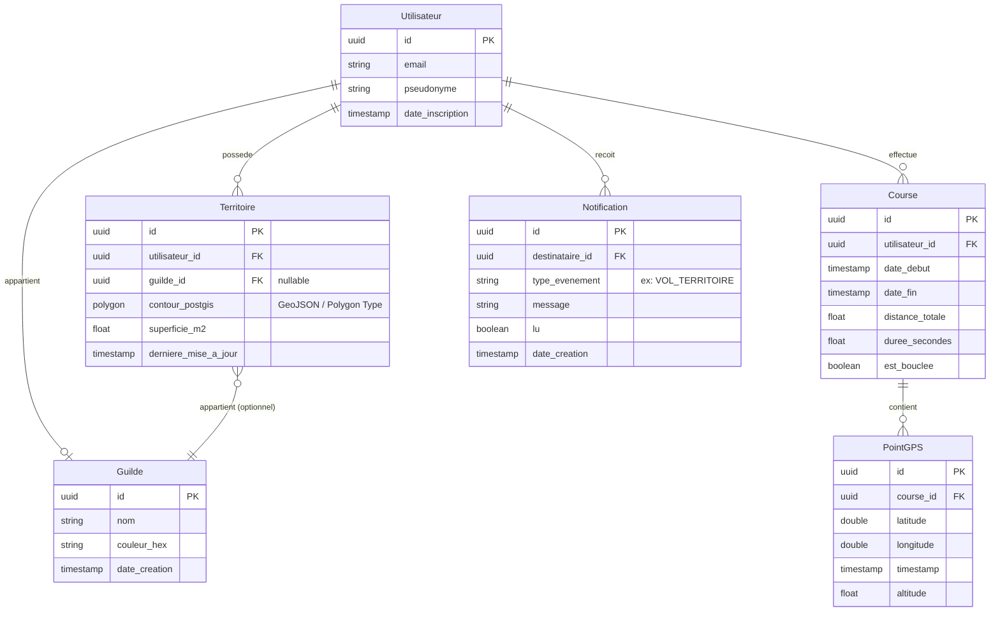

# Cahier des Charges Fonctionnel : Arpent.io

> **Version :** 1.0  
> **Statut :** Document de référence évolutif (évolutif au fil du temps)  
> **Dernière mise à jour :** 14 Juin 2026  

---

## 1.0 Résumé et Proposition de Valeur

### Concept
**Arpent.io** est une application mobile sportive qui transforme la course à pied et la marche active dans le monde réel en un jeu de conquête de territoire multijoueur asynchrone (inspiré du concept de *Paper.io*).

### Objectif Principal
Éliminer la monotonie et la lassitude associées à la course à pied traditionnelle en offrant aux coureurs une motivation ludique, compétitive et communautaire pour explorer de nouveaux trajets, sortir régulièrement et dominer leur zone géographique.

### Facteur Différenciant (Positionnement Marketing)
Contrairement aux applications de suivi traditionnelles (comme Strava ou Garmin) centrées sur les métriques brutes de performance (vitesse, rythme, dénivelé), **Arpent.io** met l'accent sur l'impact géographique et l'occupation territoriale. La boucle de dopamine est alimentée par :
* La conquête de nouvelles parcelles.
* Le frisson de voler le territoire d'une guilde ou d'un joueur adverse.
* La visualisation de l'empreinte de sa propre guilde sur une carte 3D immersive et vivante.

---

## 2.0 Personas et Parcours Utilisateurs (User Stories)

### Persona Utilisateur : "Le Coureur Gamifié"
* **Profil :** Homme ou femme, 18-35 ans. Pratique occasionnellement la course à pied ou la marche rapide, mais se lasse rapidement de la monotonie de ses parcours habituels.
* **Besoin :** Recherche une source de motivation externe, ludique et sociale pour transformer ses efforts physiques en réalisations concrètes.
* **User Stories :**
  1. *En tant qu'utilisateur*, je veux voir mon environnement immédiat sur une carte 3D fluide dès l'ouverture de l'application afin de planifier ma stratégie de course instantanément.
  2. *En tant qu'utilisateur*, je veux que mon tracé de course crée une géométrie fermée (boucle) afin de capturer la zone englobée et d'étendre mon territoire.
  3. *En tant qu'utilisateur*, je veux pouvoir amputer le territoire d'une guilde ou d'un joueur adverse en croisant sa zone afin de ressentir un sentiment de victoire compétitive.
  4. *En tant qu'utilisateur*, je veux pouvoir recommencer de zéro si l'intégralité de mon territoire est conquise par des tiers, afin de ne jamais être définitivement exclu de l'expérience de jeu.

### Persona Administrateur : "Le Maître du Jeu"
* **Profil :** L'équipe de développement et d'administration d'Arpent.io (vous-même).
* **Besoin :** Assurer la stabilité technique de la plateforme, modérer la carte des conflits et configurer les intégrations tierces.
* **User Stories :**
  1. *En tant qu'administrateur*, je veux pouvoir configurer les clés d'accès aux cartes (Map Provider Token) afin de garantir l'affichage continu des environnements 3D pour les joueurs.
  2. *En tant qu'administrateur*, je veux visualiser les guildes les plus actives du réseau afin de pouvoir organiser des événements ou des saisons compétitives adaptées.

---

## 3.0 Fonctionnalités Détaillées : Vue Utilisateur

| ID_FONC | Fonctionnalité | Description Détaillée (UI/UX, Rôle Marketing) | Priorité |
| :--- | :--- | :--- | :--- |
| **U-01** | **Carte 3D Immersive (Mise en cache)** | L'écran d'accueil est une carte 3D interactive centrée sur la position GPS actuelle du joueur. Les parcelles de carte téléchargées sont stockées en cache local.  *Justification marketing :* Assure un effet "Wow" immédiat et élimine les temps de chargement fastidieux à l'ouverture, maximisant l'engagement utilisateur initial. | **Essentiel** |
| **U-02** | **Tracking & Bouclage (Capture)** | Suivi GPS du joueur pendant sa course. Dès que le tracé actuel croise une portion appartenant déjà au joueur (ou son point de départ de la session), la zone polygonale fermée ainsi créée est capturée et colorée à sa couleur.  *Justification pédagogique :* Mécanique de base (Core Loop). Le remplissage visuel de la zone et l'affichage de la progression territoriale offrent la récompense immédiate requise par le cerveau. | **Essentiel** |
| **U-03** | **Système de Vol de Territoire** | Si le polygone dessiné par le coureur englobe une partie d'un territoire appartenant à une autre guilde ou un autre joueur, cette partie change instantanément de couleur et de propriétaire.  *Justification marketing :* Crée une rivalité asynchrone puissante. Le concept de "perte de territoire" motive fortement les joueurs dépossédés à courir à nouveau pour reprendre leur bien (aversion à la perte). | **Essentiel** |
| **U-04** | **Mécanique de Respawn (Renaissance)** | Si un joueur est totalement éliminé de la carte (0% de territoire possédé), il peut démarrer une nouvelle session de course n'importe où pour créer une première boucle d'ancrage et relancer son empire.  *Justification UX :* Prévient la frustration excessive des joueurs débutants ou dépassés et réduit le taux d'abandon (Churn). | **Essentiel** |
| **U-05** | **Gestion des Guildes (Équipes)** | Possibilité de créer ou de rejoindre un clan/guilde. Toutes les parcelles de territoire conquises par les membres d'une même équipe sont fusionnées visuellement sous une couleur unique.  *Justification marketing :* La dimension sociale démultiplie la fidélisation à long terme et l'engagement grâce à l'esprit d'équipe. | **Recommandé** |
| **U-06** | **Synchronisation Asynchrone** | Les calculs géométriques et de collisions sont effectués localement sur le smartphone pendant l'effort. Les résultats finaux (scores, nouveaux contours de polygones) sont envoyés au serveur Supabase uniquement à la fin du bouclage.  *Justification UX :* Assure une expérience de course fluide et ininterrompue, sans dépendance vis-à-vis d'une couverture réseau parfaite (zones forestières, campagnes). | **Essentiel** |

---

## 4.0 Fonctionnalités Détaillées : Vue Administrateur

| ID_FONC | Fonctionnalité | Description Détaillée | Priorité |
| :--- | :--- | :--- | :--- |
| **A-01** | **Configuration du Fournisseur de Cartes** | Panneau de configuration permettant de définir le fournisseur de cartes 3D. Contient un champ crypté/sécurisé pour stocker les jetons d'accès d'API publics (ex: Mapbox public token). | **Essentiel** |
| **A-02** | **Console de Résolution des Conflits** | Outil d'administration permettant de recalculer l'attribution d'une zone territoriale ou de purger des données aberrantes (détection de triche GPS, bugs de géolocalisation). | **Recommandé** |
| **A-03** | **Tableau de Bord Marketing (Statistiques)** | Graphiques mettant en avant les points chauds géographiques de haute compétition et les périodes d'activité journalières clés pour aider à planifier les opérations promotionnelles. | **Optionnel** |

---

## 5.0 Modèle de Données Conceptuel

Le modèle s'appuie sur la base de données relationnelle Supabase pour assurer la synchronisation en temps réel et les jointures spatiales (via l'extension **PostGIS** recommandée pour la gestion des polygones GPS).

