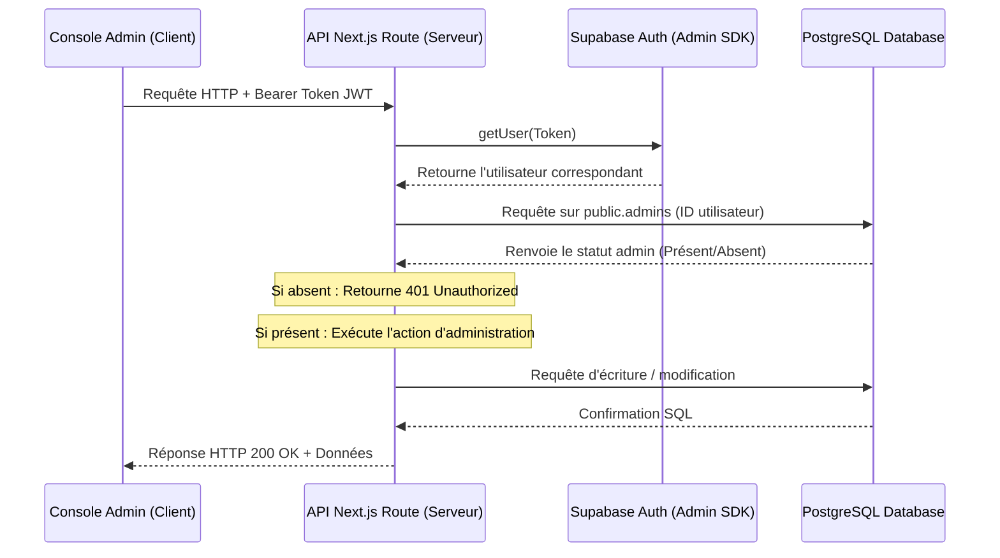

# Inventaire Technique : Données Utilisateurs, Rôles & Intégration Administration (Arpent.io)

Ce document dresse un état des lieux exhaustif de la structure des données des utilisateurs au sein de la base de données Supabase, de la gestion de leurs droits (RLS et tables de rôles), ainsi que des interactions avec la console d'administration Web (web-admin). L'objectif est de fournir une cartographie claire pour faciliter l'ajout de nouvelles fonctionnalités et permissions.

---

## 1. Modèle de Données Utilisateur & Relations

L'architecture s'appuie sur une séparation claire entre l'authentification gérée par Supabase (`auth.users`) et les données applicatives métiers dans le schéma `public`.

### Schéma Relationnel des Utilisateurs

```mermaid
erDiagram
    auth_users {
        uuid id PK
        string email
        string encrypted_password
    }
    profiles {
        uuid id PK, FK
        string pseudonyme UNIQUE
        uuid guilde_id FK
        float total_area_m2
        float all_time_area_m2
        boolean share_location
        string avatar_url
        string empire_color
        float latitude
        float longitude
        string tag UNIQUE
        string grade
        timestamp date_inscription
    }
    admins {
        uuid id PK, FK
        string role "super_admin | moderateur"
        string nom_complet
        string avatar_url
        timestamp derniere_connexion
        timestamp date_creation
    }
    guildes {
        uuid id PK
        string nom UNIQUE
        string tag UNIQUE
        string couleur_hex
        string avatar_url
        uuid chef_id FK
        timestamp date_creation
    }
    courses {
        uuid id PK
        uuid utilisateur_id FK
        timestamp date_debut
        timestamp date_fin
        float distance_totale
        float duree_secondes
        boolean est_bouclee
        float vitesse_moyenne
        float vitesse_max
        float allure_moyenne
        float calories_estimees
        float denivele_positif
        float denivele_negatif
        integer points_gps_count
    }
    territoires {
        uuid id PK
        uuid utilisateur_id FK
        uuid guilde_id FK
        geometry contour
        float superficie_m2
        string_array points
        timestamp derniere_mise_a_jour
    }
    amis {
        uuid id PK
        uuid demandeur_id FK
        uuid destinataire_id FK
        string statut "en_attente | accepte"
        timestamp date_creation
    }

    auth_users ||--|| profiles : "1:1 Extension métier"
    auth_users ||--o| admins : "1:0..1 Rôle admin"
    profiles ||--o| guildes : "Appartient à / Dirige"
    profiles ||--o{ courses : "Réalise"
    profiles ||--o{ territoires : "Possède"
    profiles ||--o{ amis : "Initie ou reçoit"
```

---

## 2. Description Détaillée des Tables et Champs

### A. Table `public.profiles`
Cette table prolonge `auth.users` pour y adjoindre les informations de jeu et de profil.

| Champ | Type | Contraintes / Défaut | Description / Rôle |
| :--- | :--- | :--- | :--- |
| `id` | `uuid` | `PRIMARY KEY`, `REFERENCES auth.users ON DELETE CASCADE` | Identifiant unique de l'utilisateur (identique à Supabase Auth). |
| `pseudonyme` | `text` | `UNIQUE` | Nom d'affichage choisi par le joueur. |
| `guilde_id` | `uuid` | `REFERENCES public.guildes(id) ON DELETE SET NULL` | Identifiant du clan/guilde auquel appartient le joueur. |
| `total_area_m2` | `float` | Non nul, défaut `0.0` | Surface actuellement contrôlée par le joueur (mis à jour en temps réel par trigger). |
| `all_time_area_m2`| `float` | Non nul, défaut `0.0` | Surface cumulée historique conquise (ne diminue pas en cas de perte de territoire). |
| `share_location` | `boolean` | Non nul, défaut `true` | Autorise le partage de la position GPS temps réel sur la carte. |
| `avatar_url` | `text` | Optionnel | Lien vers le stockage de l'avatar du joueur. |
| `empire_color` | `text` | Défaut `'#00E676'` | Couleur hexadécimale associée au territoire et marqueur du joueur. |
| `latitude` | `float` | Optionnel | Dernière latitude GPS connue du joueur. |
| `longitude` | `float` | Optionnel | Dernière longitude GPS connue du joueur. |
| `tag` | `text` | `UNIQUE` | Tag immuable au format `#AA11AA11` servant d'identifiant convivial. |
| `grade` | `text` | Défaut `'membre'`, `CHECK (grade IN ('chef', 'adjoint', 'membre'))` | Rang au sein de la guilde/clan. |
| `date_inscription`| `timestamptz`| Défaut `now()` | Date d'enregistrement dans le système. |

> [!NOTE]
> **Création de Profil Automatique :** 
> Un trigger PostgreSQL `on_auth_user_created` écoute l'insertion dans `auth.users` et insère automatiquement une ligne correspondante dans `public.profiles` en générant un pseudonyme par défaut (`Joueur_XXXX` ou `Invité_XXXX`) ainsi qu'un tag aléatoire via la fonction SQL `generate_unique_tag`.

---

### B. Table `public.admins`
Cette table recense les comptes dotés de privilèges d'administration et de modération.

| Champ | Type | Contraintes / Défaut | Description / Rôle |
| :--- | :--- | :--- | :--- |
| `id` | `uuid` | `PRIMARY KEY`, `REFERENCES auth.users ON DELETE CASCADE` | Identifiant unique de l'administrateur. |
| `role` | `text` | Non nul, défaut `'moderateur'`, `CHECK (role IN ('super_admin', 'moderateur'))` | Niveau d'accès d'administration. |
| `nom_complet` | `text` | Optionnel | Nom ou pseudonyme administratif de l'utilisateur. |
| `avatar_url` | `text` | Optionnel | URL de l'image de profil de l'administrateur. |
| `derniere_connexion`| `timestamptz`| Défaut `now()` | Date et heure de la dernière connexion à la console d'administration. |
| `date_creation` | `timestamptz`| Défaut `now()` | Date de désignation du rôle d'administration. |

---

## 3. Modèle de Droits (Row Level Security - RLS)

La base de données applique la sécurité au niveau des lignes (RLS) sur toutes ses tables publiques. Les droits sont combinés entre le jeton de l'utilisateur connecté (`auth.uid()`) et les fonctions privilégiées.

### Fonction utilitaire d'administration
Pour bypasser ou valider les privilèges d'accès, la fonction suivante est exécutée avec les droits du créateur (`SECURITY DEFINER`) :
```sql
CREATE OR REPLACE FUNCTION public.is_admin(p_user_id uuid)
RETURNS boolean AS $$
BEGIN
    RETURN EXISTS (
        SELECT 1 FROM public.admins WHERE id = p_user_id
    );
END;
$$ LANGUAGE plpgsql SECURITY DEFINER;
```

### Synthèse des règles RLS appliquées

| Table | SELECT | INSERT | UPDATE | DELETE |
| :--- | :--- | :--- | :--- | :--- |
| **`profiles`** | 🔓 Public (`true`) | 🛡️ `is_admin(auth.uid())` | 👤 `auth.uid() = id` <br>ou 🛡️ `is_admin(auth.uid())` | 🛡️ `is_admin(auth.uid())` |
| **`admins`** | 🛡️ `is_admin(auth.uid())` | 🚫 Personne | 🚫 Personne | 🚫 Personne |
| **`guildes`** | 🔓 Public (`true`) | 👤 Authentifié | 👑 `auth.uid() = chef_id` <br>ou 🛡️ `is_admin(auth.uid())` | 👑 `auth.uid() = chef_id` <br>ou 🛡️ `is_admin(auth.uid())` |
| **`courses`** | 👤 `auth.uid() = utilisateur_id` <br>ou 🛡️ `is_admin(auth.uid())` | 👤 `auth.uid() = utilisateur_id` <br>ou 🛡️ `is_admin(auth.uid())` | 🛡️ `is_admin(auth.uid())` | 🛡️ `is_admin(auth.uid())` |
| **`territoires`**| 🔓 Public (`true`) | 👤 `auth.uid() = utilisateur_id` <br>ou 🛡️ `is_admin(auth.uid())` | 👤 `auth.uid() = utilisateur_id` <br>ou 🛡️ `is_admin(auth.uid())` | 🚫 Personne (géré via fusion/calcul SQL) |
| **`points_gps`** | 👤 Lié à une course propre <br>ou 🛡️ `is_admin(auth.uid())` | 👤 Lié à une course propre <br>ou 🛡️ `is_admin(auth.uid())` | 🚫 Personne | 🚫 Personne |
| **`amis`** | 👤 `auth.uid()` fait partie de la relation | 👤 `auth.uid() = demandeur_id`| 👤 Fait partie de la relation | 👤 Fait partie de la relation |

> [!WARNING]
> **Sécurité des Tables Privées :** 
> La table de configuration spatiale interne `public.spatial_ref_sys` a été sécurisée en révoquant explicitement tous les droits d'accès aux rôles publics (`anon` et `authenticated`) afin de prévenir des escalades de privilèges.

---

## 4. Intégration et Liens avec la Console Web Admin

La console d'administration (`web-admin`) est une application Next.js qui exploite la structure de droits de Supabase pour encadrer ses opérations.

### A. Authentification Front-end (`AuthWrapper.tsx`)
1. Lorsque l'utilisateur tente de s'authentifier sur la console d'administration, le composant `AuthWrapper` appelle la méthode classique `supabase.auth.signInWithPassword`.
2. Une fois la session obtenue, une requête SELECT est immédiatement soumise sur la table `public.admins` pour le compte connecté :
   ```typescript
   const { data: adminRecord } = await supabase
     .from('admins')
     .select('id')
     .eq('id', session.user.id)
     .maybeSingle();
   ```
3. **Contrôle d'accès :** Si aucun enregistrement n'existe dans la table `admins` pour cet utilisateur, l'application exécute instantanément un `supabase.auth.signOut()`, efface la session et affiche un message d'erreur d'autorisation.

### B. Sécurisation des API Routes Back-end (`/api/admin/*`)
Les actions critiques (modification globale de profils, suppression de comptes) passent par les API Next.js (par exemple `/api/admin/profiles/route.ts`). Ces API effectuent une validation stricte :



1. **Extraction du Jeton :** Récupération du jeton JWT Bearer de l'utilisateur connecté dans l'en-tête `Authorization`.
2. **Identification :** Appel de `supabaseAdmin.auth.getUser(token)` pour extraire de manière sécurisée l'ID de l'utilisateur connecté à l'origine de l'appel.
3. **Contrôle d'autorisation :** Requête vers la table `admins` avec le client d'administration privilégié pour confirmer que l'auteur est bien répertorié.
4. **Exécution des requêtes d'écriture :** Si la validation réussit, les requêtes SQL et d'authentification sont émises par le biais de `supabaseAdmin` (qui utilise le rôle `service_role` de Supabase et contourne ainsi les politiques RLS restrictives).

### C. Actions d'Administration Existantes

#### 1. Gestion des Profils (PUT `/api/admin/profiles`)
Permet de modifier le pseudonyme d'un joueur ou de supprimer/réinitialiser sa photo de profil. En cas de suppression de l'avatar, l'API nettoie également le bucket de stockage de Supabase (`Images` bucket) en supprimant le fichier physique.

#### 2. Suppression de Compte Utilisateur (DELETE `/api/admin/profiles`)
L'administrateur peut supprimer définitivement un joueur :
1. L'API appelle `supabaseAdmin.auth.admin.deleteUser(userId)` pour effacer le compte d'authentification Supabase.
2. **Effet de Cascade SQL :** Par le biais des clés étrangères PostgreSQL paramétrées sur `ON DELETE CASCADE`, toutes les lignes associées dans les tables `profiles`, `courses`, `points_gps` et `territoires` sont automatiquement purgées de la base de données.
3. L'API nettoie ensuite manuellement le fichier d'avatar de l'utilisateur dans le stockage de Supabase.

#### 3. Gestion des Clans/Guildes (PUT/DELETE `/api/admin/guilds`)
Permet de renommer un clan, modifier sa couleur hexadécimale, changer son chef (`chef_id`) ou dissoudre complètement la guilde (ce qui libère les joueurs et les territoires en passant leur `guilde_id` à `NULL` via `ON DELETE SET NULL`).

---

## 5. Synthèse pour l'Ajout de Nouvelles Fonctionnalités

Si vous devez ajouter de nouvelles fonctionnalités ou de nouveaux droits, gardez en tête les règles et étapes suivantes :

1. **Création d'une nouvelle table métier :**
   - Toujours lier la table au profil de l'utilisateur via une contrainte : `utilisateur_id uuid REFERENCES public.profiles(id) ON DELETE CASCADE`.
   - Activer systématiquement la sécurité RLS : `ALTER TABLE public.nom_table ENABLE ROW LEVEL SECURITY;`.
   
2. **Mise en place des politiques de sécurité (RLS) :**
   - Permettre à l'utilisateur de gérer ses propres lignes : 
     ```sql
     CREATE POLICY "User management" ON public.nom_table
     TO authenticated
     USING (auth.uid() = utilisateur_id)
     WITH CHECK (auth.uid() = utilisateur_id);
     ```
   - Permettre systématiquement le contrôle des administrateurs pour la modération :
     ```sql
     CREATE POLICY "Admin management" ON public.nom_table
     USING (public.is_admin(auth.uid()))
     WITH CHECK (public.is_admin(auth.uid()));
     ```

3. **Ajout d'actions administratives dans `web-admin` :**
   - Créer ou enrichir les fichiers sous `web-admin/src/app/api/admin/`.
   - Réutiliser systématiquement la fonction locale `verifyAdmin(request)` pour protéger les points d'accès.
   - Utiliser `supabaseAdmin` uniquement après validation de l'identité de l'administrateur.
